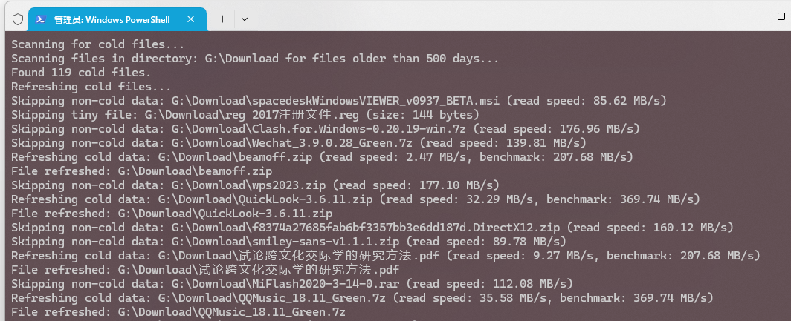

# ColDataRefresh
智能检测固态硬盘的冷数据并解决冷数据掉速问题，带数据校验功能

### 什么是冷数据
冷数据指存放在硬盘上且较长时间（如半年甚至更长）没有进行重新写入或者更新的数据，直观上以文件为单位，实际上反应到物理层面是文件对应的存储单元。通常，长时间存储在硬盘上的文档、视频、音乐、图片等静态资料都是冷数据，甚至操作系统、程序和游戏在较长一段时间内只读取过却没有修改或者更新的任何文件都会在未来“成长为”冷数据（热更新或者增量更新现在已经很成熟，一般来讲系统、游戏、应用的更新只会更新需要修改的部分，不需要修改的部分不会动）。
**注意，冷数据的形成只和写入有关，与读取频次无关，一个文件即使经常读取但是不修改写入，一样有可能成为冷数据**（这也是有人反应经常玩的游戏因为冷数据掉速导致加载变慢的原因）。

### 冷数据会造成什么问题
固态硬盘上的冷数据可能会造成读取速度变慢的情况，极端情况下甚至会无法读取。

> 像三星的大部分固态硬盘固件会在空闲期间给冷数据进行移动以“加温”，但是部分厂商的固件不具备此功能。这是本工具开发的原因。
> 注意：固态硬盘的Trim功能/硬盘碎片整理并不能缓解硬盘冷数据读取变慢的现象。

### 怎么判断/解决我的硬盘出现冷数据读取掉速问题

最简单的，找一个躺在你硬盘上很久（如两年以上）且没有修改过的文件，把它复制到其他硬盘上，观察复制速度是否下降了？
将该文件复制回来，该问题就解决了（因为文件变成“新”写入的了，不再是冷数据了）

你也可以使用本工具，本工具会自动判断你的文件是否属于冷数据。

### 本工具的特点/与 `DiskFresh`等工具的区别

1. `DiskFresh`也是为处理冷数据而设计的，但是DiskFresh是基于更加底层的磁盘`Sector（扇区）`层面进行全面的覆写。其缺点是刷新时间长，会刷新不必要的非冷数据区块，可能会缩减硬盘寿命；**本工具基于文件系统层面，仅刷新检测到的冷数据，并且带有CRC文件校验，更加安全快速。**、
2. 软件支持保存文件刷新进度，你可以随时退出并在下次继续数据刷新的操作
3. 本软件开源。

### 如何使用

> 程序会尝试申请管理员权限，这是必要的，可以不授予权限，但特定文件可能会访问或者覆写失败。

1. Releases界面有编译的exe二进制文件，下载双击运行 / 你也可以从python源代码运行（这样你就可以修改全局变量了）
2. 输入你需要扫描冷数据的目录，如`"D:\DL"`(目录需要包含引号，Windows用户可以选中文件夹按`Ctrl+Shift+C`复制目录地址)，按下回车
3. 输入冷数据天数，如`300`，程序会扫描最后一次修改大于300天的文件。（输入0将会扫描目录下所有文件），按下回车程序即可运行。
4. **重要：如果运行中需要退出程序，请先在控制台按下`Ctrl+C`发送终止命令，否则可能会造成数据丢失！**

### 程序截图 Screenshots

